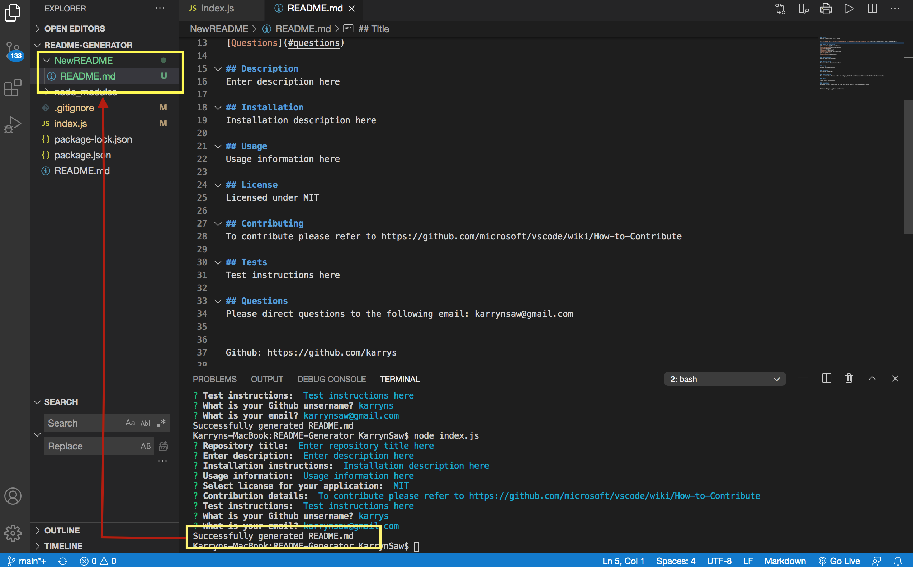

## README Generator

## Table of Contents
[Description](#Description)  
[Installation](#Installation)  
[Usage](#Usage)  
[License](#License)  
[Contributing](#Contributing)  
[Tests](#Tests)   
[Questions](#questions)  

## Description
A command-line application that allows users to easily generate a professional README file for their project. 

## Installation
Clone the package and inside the package directory install (npm i) all dependencies via terminal into your local node_ modules folder. 

## Usage
After installation, enter 'node index.js' into the command line to run the application.

 
<a href="https://drive.google.com/file/d/1Yn6FGISPUsY4ghxPcTrzX2K2YgrYoVa9/view"> Link to Demo Video</a>

## License

## Contributing
To contribute please refer to https://github.com/microsoft/vscode/wiki/How-to-Contribute

## Tests

## Questions
Please direct questions to the following email: karrynsaw@gmail.com

Github: https://github.com/karryns
    
